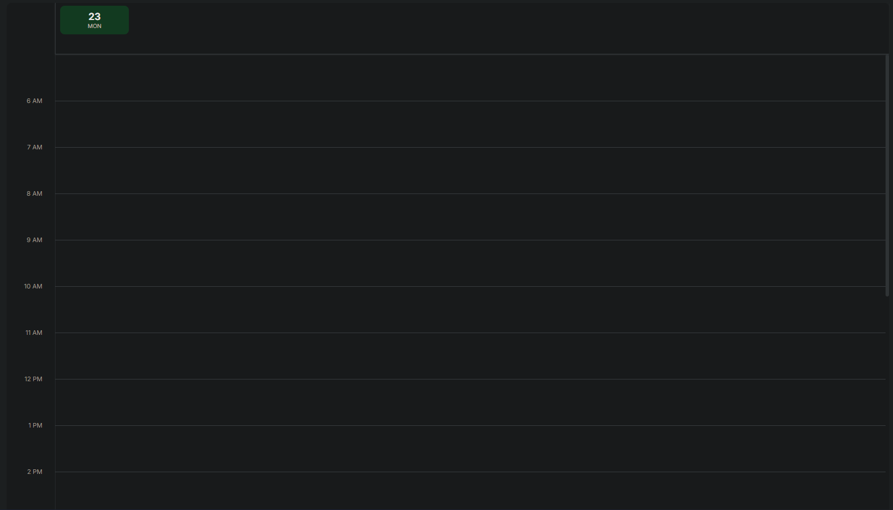
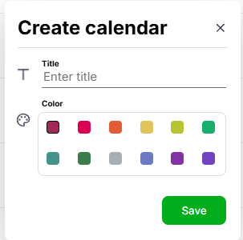
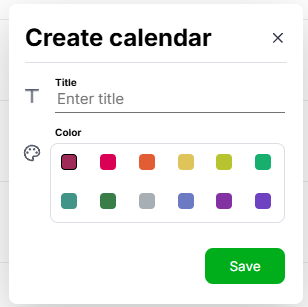

  # 🗓️ Web Calendar

  **A modern, intuitive, and feature-rich calendar application.**

  [](https://react.dev/)
  [](https://www.typescriptlang.org/)
  [](https://vitejs.dev/)
  [](https://github.com/pmndrs/zustand)
  [](https://sass-lang.com/)

  [Features](#features) • [Installation](#installation) • [Usage](#usage) • [Architecture](#architecture) • [Contributing](#contributing)
</div>

---

## ✨ Features

- **Intuitive Interface**: Clean, modern design focused on usability and speed.
- **Responsive Design**: Works seamlessly across desktop, tablet, and mobile devices.
- **Event Management**: Easily create, edit, move, and delete calendar events.
- **Light/Dark Mode**: Built-in theme support for comfortable viewing at any time of day.
- **State of the Art Architecture**: Built using Feature-Sliced Design (FSD) for maximum scalability and code organization.

## 📸 Screenshots


| Day View | Calendar Creation | Event Creation |
| :---: | :---: | :---: |
|  |  |  |


## � Quick Start

### Prerequisites

Make sure you have [Node.js](https://nodejs.org/) (v18+) installed on your machine.

### Installation

1. **Clone the repository**
   ```bash
   git clone https://github.com/yourusername/web-calendar.git
   cd web-calendar
   ```

2. **Install dependencies**
   ```bash
   npm install
   ```

3. **Start the development server**
   ```bash
   npm run dev
   ```

4. Open `http://localhost:5173` in your browser.

## 🏗️ Architecture

This project strictly follows the [Feature-Sliced Design (FSD)](https://feature-sliced.design/) architectural methodology to ensure the codebase remains maintainable as the application scales.

<details>
<summary><b>Click to expand project structure</b></summary>

```text
src/
├── app/          # App setup, global styles, providers
├── pages/        # Composition of features/widgets into full routes
├── widgets/      # Independent, reusable UI blocks (e.g., Header, CalendarGrid)
├── features/     # Specific business logic and user actions (e.g., CreateEvent)
├── entities/     # Buisness entities (e.g., Event type, User type, shared store slices)
└── shared/       # Reusable UI components, utilities, and API configuration
```
</details>

## �️ Scripts Overview

- `npm run dev`: Starts the Vite development server with Hot Module Replacement (HMR).
- `npm run build`: Compiles TypeScript and creates an optimized production build in the `dist` directory.
- `npm run preview`: Locally previews the production build.
- `npm run lint`: Runs ESLint to identify and fix code style issues.

## 🤝 Contributing

Contributions are what make the open source community such an amazing place to learn, inspire, and create. Any contributions you make are **greatly appreciated**.

1. Fork the Project
2. Create your Feature Branch (`git checkout -b feature/AmazingFeature`)
3. Commit your Changes (`git commit -m 'Add some AmazingFeature'`)
4. Push to the Branch (`git push origin feature/AmazingFeature`)
5. Open a Pull Request
